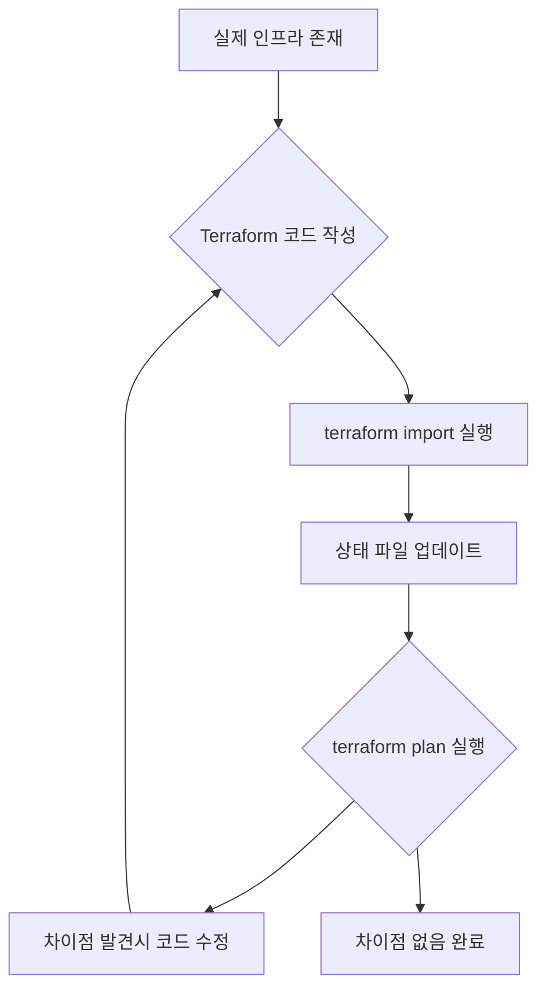

[이전 학습](../3-Understand-Terraform-basics/3d-Describe-how-Terraform-finds-and-fetches-providers.md) | [챕터 목록](./README.md) | [전체 목록](../README.md) | [다음 학습](./4b-Use-terraform-state-to-view-Terraform-state.md)

---

# 4a. `terraform import`를 사용하여 기존 인프라를 Terraform 상태로 가져오기

`terraform import`는 이미 수동으로(예: 웹 콘솔, CLI) 생성되어 있는 실제 인프라 리소스를 Terraform의 상태(`terraform.tfstate`) 파일 안으로 "가져오는" 기능을 하는 강력한 명령어입니다.

이 명령어를 사용하면, 기존에 Terraform으로 관리하지 않던 리소스를 코드 기반으로 관리할 수 있게 전환할 수 있습니다.

## `terraform import`는 언제 사용하는가?

`terraform import`는 다음과 같은 시나리오에서 매우 유용합니다.

1.  **기존 수동 관리 인프라를 코드로 전환할 때**:
    가장 일반적인 경우입니다. 이미 운영 중인 서비스의 인프라가 웹 콘솔 등을 통해 수동으로 구축되었을 때, 이 인프라를 중단 없이 Terraform 관리 체계로 편입시키고 싶을 때 사용합니다.

2.  **실수로 Terraform 외부에서 리소스를 생성했을 때**:
    팀원이 실수로 Terraform을 통하지 않고 중요한 리소스를 만들었을 경우, 해당 리소스를 삭제하고 다시 코드로 만드는 대신 `import`하여 상태에 포함시킬 수 있습니다.

3.  **리소스의 일부만 Terraform으로 관리 시작할 때**:
    전체 인프라가 아닌, 특정 부분(예: 복잡한 네트워크 설정)부터 점진적으로 Terraform 관리를 도입하고 싶을 때 유용합니다.

## `terraform import`의 작동 방식 및 주의사항

`terraform import`의 작동 방식을 이해하는 것은 매우 중요합니다.

**`terraform import`는 코드를 자동으로 생성해주지 않습니다.**

이 명령어는 오직 **상태 파일(`terraform.tfstate`)만 업데이트**합니다. `import`의 역할은 "이 실제 리소스는 이제부터 이 Terraform 리소스 주소와 연결된다"라고 상태 파일에 기록하는 것뿐입니다.

따라서 `import`를 성공적으로 사용하려면 다음 3단계 프로세스를 반드시 따라야 합니다.

1.  **리소스 구성 코드 작성**: 가져오려는 실제 리소스와 일치하는 리소스 블록을 `.tf` 파일에 **직접 작성**해야 합니다. (예: `resource "aws_instance" "my_server" {}`)
2.  **`import` 명령어 실행**: CLI에서 `terraform import <리소스 주소> <리소스 ID>` 형식으로 명령을 실행하여 실제 리소스를 상태 파일로 가져옵니다.
3.  **코드와 상태 동기화**: `terraform plan`을 실행하여 코드와 상태 파일(가져온 리소스의 속성)을 비교합니다. `plan` 결과에 차이가 없다면 성공입니다. 만약 차이가 있다면, 1단계에서 작성한 코드의 인수를 실제 리소스의 속성과 일치하도록 수정해야 합니다.

### Mermaid 다이어그램: `import` 프로세스



## Terraform 코드 및 명령어 예시

AWS에 `i-0123456789abcdef0` 라는 ID를 가진 EC2 인스턴스가 이미 존재한다고 가정해 보겠습니다.

**1. HCL 코드 작성 (`main.tf`)**

가져올 리소스에 해당하는 빈 리소스 블록을 먼저 정의합니다.

```terraform
# 이 블록은 import 대상 리소스를 위한 '자리'입니다.
# 인수는 비워두거나, 이미 아는 값으로 채워둘 수 있습니다.
resource "aws_instance" "existing_server" {
  # 인수는 나중에 plan을 보고 채울 것이므로 일단 비워둡니다.
}
```

**2. Import 명령어 실행**

CLI에서 다음 명령을 실행합니다.

```bash
# terraform import <리소스 주소> <실제 리소스 ID>
terraform import aws_instance.existing_server i-0123456789abcdef0
```

성공적으로 실행되면, Terraform은 AWS API를 통해 `i-0123456789abcdef0` 인스턴스의 현재 모든 속성(AMI ID, 인스턴스 타입 등)을 읽어와 `terraform.tfstate` 파일 내의 `aws_instance.existing_server`에 기록합니다.

**3. 코드와 상태 동기화**

이제 `terraform plan`을 실행합니다. `main.tf`의 `aws_instance.existing_server` 블록은 비어있지만, 상태 파일에는 실제 리소스의 속성이 가득 채워져 있으므로, Terraform은 수많은 "변경" 사항을 표시할 것입니다.

`plan`의 출력 결과를 보고, `main.tf`의 `aws_instance.existing_server` 리소스 블록에 실제 값과 동일하게 인수를 채워 넣습니다.

```terraform
# plan 결과를 바탕으로 실제 리소스와 동일하게 코드를 채워넣습니다.
resource "aws_instance" "existing_server" {
  ami           = "ami-0c55b159cbfafe1f0"
  instance_type = "t2.micro"
  tags = {
    Name = "My-Manual-Server"
  }
  # ... 기타 필요한 인수들
}
```

코드를 수정한 후 다시 `terraform plan`을 실행했을 때 "No changes. Your infrastructure matches the configuration." 메시지가 나타나면, 성공적으로 기존 리소스를 Terraform 관리하에 두게 된 것입니다.

---

## 예상 문제

1.  **`terraform import` 명령어의 주된 목적은 무엇입니까?**<br>
    a. Terraform 코드를 기반으로 새로운 인프라를 생성한다.<br>
    b. 기존 인프라 리소스를 분석하여 Terraform 코드를 자동으로 생성한다.<br>
    c. 이미 존재하는 인프라 리소스를 Terraform 상태 파일로 가져와 관리 대상으로 포함시킨다.<br>
    d. 상태 파일의 백업을 생성한다.<br>
    <br>
    <details>
    <summary>정답 확인</summary>
    <p>c</p>
    </details><br>

2.  **`terraform import`를 실행하면 어떤 파일이 직접적으로 변경됩니까?**<br>
    a. `main.tf`<br>
    b. `terraform.tfvars`<br>
    c. `terraform.tfstate`<br>
    d. `.terraform.lock.hcl`<br>
    <br>
    <details>
    <summary>정답 확인</summary>
    <p>c</p>
    </details><br>

3.  **`terraform import`를 성공적으로 수행하기 위해 가장 먼저 해야 할 일은 무엇입니까?**<br>
    a. `terraform plan` 실행<br>
    b. `terraform apply` 실행<br>
    c. 상태 파일 수동 편집<br>
    d. 가져올 리소스에 해당하는 구성 코드를 `.tf` 파일에 작성<br>
    <br>
    <details>
    <summary>정답 확인</summary>
    <p>d</p>
    </details><br>

4.  **다음 `terraform import` 명령어의 구문으로 올바른 것은 무엇입니까?**<br>
    a. `terraform import <리소스 ID> <리소스 주소>`<br>
    b. `terraform import <리소스 주소> <리소스 ID>`<br>
    c. `terraform import --resource-address <주소> --resource-id <ID>`<br>
    d. `terraform import <리소스 종류> <리소스 이름> <리소스 ID>`<br>
    <br>
    <details>
    <summary>정답 확인</summary>
    <p>b. 리소스 주소(예: `aws_instance.web`)가 먼저 오고, 실제 리소스의 고유 식별자(예: `i-12345`)가 뒤에 옵니다.</p>
    </details><br>

5.  **`terraform import` 실행 후 `terraform plan`을 실행했더니 많은 변경 사항이 감지되었습니다. 다음 단계로 가장 적절한 것은 무엇입니까?**<br>
    a. 즉시 `terraform apply`를 실행하여 인프라를 코드와 일치시킨다.<br>
    b. `plan`의 출력 내용을 바탕으로, `.tf` 파일의 리소스 인수들을 실제 인프라의 속성과 일치하도록 수정한다.<br>
    c. 상태 파일을 삭제하고 처음부터 다시 시작한다.<br>
    d. `terraform refresh` 명령을 실행한다.<br>
    <br>
    <details>
    <summary>정답 확인</summary>
    <p>b</p>
    </details><br>

6.  **다음 중 `terraform import`를 사용하는 것이 가장 적절한 시나리오는 무엇입니까?**<br>
    a. 완전히 새로운 인프라를 처음부터 구축할 때<br>
    b. AWS 콘솔에서 수동으로 생성한 VPC를 Terraform 관리 체계로 전환하고 싶을 때<br>
    c. 인프라 변경 전 `plan`의 결과를 확인하고 싶을 때<br>
    d. 프로바이더 버전을 업그레이드하고 싶을 때<br>
    <br>
    <details>
    <summary>정답 확인</summary>
    <p>b</p>
    </details><br>

7.  **`terraform import`는 리소스의 민감한 정보(예: 비밀번호)를 상태 파일로 가져올 수 있습니까?**<br>
    a. 아니요, 민감한 정보는 절대 가져오지 않습니다.<br>
    b. 예, API가 해당 속성을 반환한다면 상태 파일에 일반 텍스트로 기록될 수 있습니다. 따라서 상태 파일 보안이 중요합니다.<br>
    c. 민감한 정보는 항상 암호화되어 가져옵니다.<br>
    d. 민감한 정보는 `.tfvars` 파일에만 저장됩니다.<br>
    <br>
    <details>
    <summary>정답 확인</summary>
    <p>b</p>
    </details><br>

8.  **리소스 주소 `module.vpc.aws_subnet.private`가 가리키는 리소스를 가져오려고 합니다. 명령어는 어떻게 작성해야 합니까?**<br>
    a. `terraform import aws_subnet.private <서브넷 ID>`<br>
    b. `terraform import module.vpc.aws_subnet.private <서브넷 ID>`<br>
    c. `terraform import module.vpc <서브넷 ID>`<br>
    d. 모듈 내의 리소스는 import 할 수 없습니다.<br>
    <br>
    <details>
    <summary>정답 확인</summary>
    <p>b</p>
    </details><br>

9.  **`terraform import`가 실패하는 일반적인 원인이 아닌 것은 무엇입니까?**<br>
    a. 지정한 리소스 ID가 실제 클라우드에 존재하지 않음.<br>
    b. `import`를 실행하는 사용자가 해당 리소스를 읽을 권한이 없음.<br>
    c. `.tf` 파일에 해당 리소스 블록이 정의되어 있지 않음.<br>
    d. 프로바이더가 해당 리소스의 `import` 기능을 지원하지 않음.<br>
    <br>
    <details>
    <summary>정답 확인</summary>
    <p>c. `import` 명령어 자체는 `.tf` 파일의 존재 여부와 상관없이 실행됩니다. 다만, 그 이후 `plan` 단계에서 문제가 됩니다.</p>
    </details><br>

10. **`terraform import`의 가장 큰 한계점 또는 사용자가 오해하기 쉬운 점은 무엇입니까?**<br>
    a. 너무 느리게 동작한다.<br>
    b. 유료 버전에서만 사용 가능하다.<br>
    c. 리소스 구성 코드를 자동으로 생성해주지 않는다는 점.<br>
    d. 한 번에 하나의 리소스만 가져올 수 있다는 점.<br>
    <br>
    <details>
    <summary>정답 확인</summary>
    <p>c. 사용자는 가져온 리소스의 코드를 직접 작성하고 동기화해야 합니다.</p>
    </details><br>

---

[이전 학습](../3-Understand-Terraform-basics/3d-Describe-how-Terraform-finds-and-fetches-providers.md) | [챕터 목록](./README.md) | [전체 목록](../../README.md) | [다음 학습](./4b-Use-terraform-state-to-view-Terraform-state.md)
