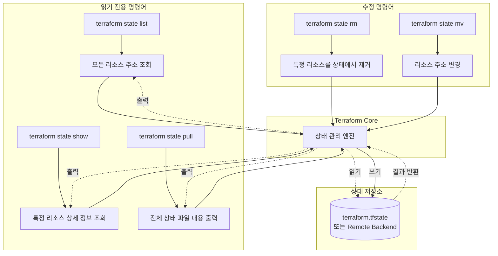

[이전 학습](./4a-Describe-when-to-use-terraform-import-to-import-existing-infrastructure-into-your-Terraform-state.md) | [챕터 목록](./README.md) | [전체 목록](../README.md) | [다음 학습](./4c-Describe-when-to-enable-verbose-logging-and-what-the-outcome-value-is.md)

---

# 4b. `terraform state`를 사용하여 Terraform 상태 조회하기

Terraform 상태 파일(`terraform.tfstate`)은 Terraform이 관리하는 인프라의 "진실의 원천"입니다. 여기에는 리소스와 실제 인프라 간의 매핑, 리소스 속성, 의존성 정보 등 민감하고 중요한 데이터가 포함되어 있습니다.

`terraform state` 명령어는 상태 파일을 직접 열어보지 않고도, 안전하게 그 내용을 조회하거나 간단히 조작할 수 있는 하위 명령어들의 집합입니다. 상태 파일을 직접 수정하는 것은 매우 위험하므로, 상태를 다룰 때는 항상 `terraform state` 명령어를 사용하는 것이 좋습니다.

## `terraform state`의 주요 하위 명령어

`terraform state`는 여러 하위 명령어를 제공하지만, 시험 및 실제 운영에서 자주 사용되는 핵심적인 조회(read-only) 명령어는 다음과 같습니다.

### 1. `terraform state list`

상태 파일이 현재 추적하고 있는 모든 리소스의 목록을 리소스 주소 형식으로 출력합니다. 어떤 리소스들이 Terraform 관리하에 있는지 전체적으로 파악할 때 유용합니다.

**사용 예시**:

```bash
$ terraform state list
aws_instance.web
aws_s3_bucket.data
random_pet.server_name
module.vpc.aws_subnet.private
```

### 2. `terraform state show <리소스 주소>`

`list`로 확인한 특정 리소스 주소의 상세 정보를 보여줍니다. 상태 파일에 저장된 해당 리소스의 모든 속성(attribute)과 그 값을 출력합니다. 리소스의 ID, IP 주소 등 특정 속성값을 확인하고 싶을 때 사용합니다.

**사용 예시**:

```bash
$ terraform state show aws_instance.web
# aws_instance.web:
resource "aws_instance" "web" {
    ami                          = "ami-0c55b159cbfafe1f0"
    arn                          = "arn:aws:ec2:us-west-2:..."
    associate_public_ip_address  = true
    availability_zone            = "us-west-2a"
    id                           = "i-0123456789abcdef0"
    instance_state               = "running"
    instance_type                = "t2.micro"
    private_ip                   = "172.31.5.12"
    public_ip                    = "54.191.12.34"
    # ... and many other attributes
}
```

### 3. `terraform state pull`

원격 백엔드(Remote Backend, 예: S3)를 사용하는 경우, 원격에 저장된 상태 파일의 내용을 그대로 로컬 터미널 화면에 출력합니다. 로컬에 파일을 저장하지 않고 원격 상태의 전체 내용을 빠르게 확인하고 싶을 때 유용합니다.

**사용 예시**:

```bash
$ terraform state pull
{
  "version": 4,
  "terraform_version": "1.5.0",
  "serial": 10,
  "lineage": "...",
  "outputs": { ... },
  "resources": [
    {
      "mode": "managed",
      "type": "aws_instance",
      "name": "web",
      "provider": "provider[\"registry.terraform.io/hashicorp/aws\"]",
      "instances": [ ... ]
    }
  ]
}
```

## 상태 조작(Manipulation) 명령어

`terraform state`에는 상태를 수정하는 명령어(예: `rm`, `mv`, `replace-provider`)도 포함되어 있습니다. 이 명령어들은 매우 강력하며, 잘못 사용하면 실제 인프라와 상태 간의 연결이 끊어지는 등 심각한 문제를 일으킬 수 있습니다. **반드시 그 의미를 정확히 알고, 필요한 경우에만 신중하게 사용해야 합니다.**

*   **`terraform state rm`**: 상태 파일에서 특정 리소스를 제거합니다. (실제 인프라는 삭제되지 않습니다.)
*   **`terraform state mv`**: 리소스의 주소를 변경합니다. (예: 리소스 이름 변경, 모듈 이동)

이러한 수정 명령어는 "핵심 워크플로우 외부에서" 사용하는 고급 기능이며, 주로 리팩토링이나 문제 해결 시나리오에서 사용됩니다.

## Mermaid 다이어그램: `state` 명령어와 상태 파일의 관계


이 다이어그램은 `terraform state` 명령어가 Terraform Core를 통해 어떻게 상태 파일과 상호작용하는지를 보여줍니다. 조회 명령어들은 상태 파일을 읽기만 하지만, `rm`과 같은 수정 명령어는 상태 파일의 내용을 변경합니다.

---

## 예상 문제

1.  **Terraform 상태 파일에 현재 어떤 리소스들이 관리되고 있는지 그 목록을 확인하고 싶을 때 사용하는 명령어는 무엇입니까?**<br>
    a. `terraform plan`<br>
    b. `terraform state list`<br>
    c. `terraform show`<br>
    d. `terraform state resources`<br>
    <br>
    <details>
    <summary>정답 확인</summary>
    <p>b</p>
    </details><br>

2.  **특정 리소스(예: `aws_instance.web`)의 ID나 IP 주소와 같은 상세 속성을 상태 파일에서 확인하려면 어떤 명령어를 사용해야 합니까?**<br>
    a. `terraform state get aws_instance.web`<br>
    b. `terraform list aws_instance.web`<br>
    c. `terraform show aws_instance.web`<br>
    d. `terraform state show aws_instance.web`<br>
    <br>
    <details>
    <summary>정답 확인</summary>
    <p>d. `terraform show`는 상태 전체나 plan 결과를 보여주지만, 특정 리소스의 상세 정보를 보려면 `terraform state show`를 사용합니다.</p>
    </details><br>

3.  **`terraform state pull` 명령어의 역할로 가장 올바른 것은 무엇입니까?**<br>
    a. 로컬 상태를 원격 백엔드로 업로드한다.<br>
    b. 원격 백엔드의 상태를 로컬 파일로 다운로드하여 저장한다.<br>
    c. 원격 백엔드의 상태 내용을 터미널 화면에 직접 출력한다.<br>
    d. 원격 백엔드의 상태를 이전 버전으로 되돌린다.<br>
    <br>
    <details>
    <summary>정답 확인</summary>
    <p>c</p>
    </details><br>

4.  **`terraform state rm aws_vpc.main` 명령을 실행하면 어떤 결과가 발생합니까?**<br>
    a. 실제 AWS에 있는 VPC와 상태 파일의 VPC 정보가 모두 삭제된다.<br>
    b. 실제 AWS에 있는 VPC는 그대로 유지되지만, 상태 파일에서만 해당 VPC에 대한 추적이 제거된다.<br>
    c. 상태 파일은 그대로 두고, 실제 AWS에 있는 VPC만 삭제된다.<br>
    d. `aws_vpc.main` 리소스의 이름이 변경된다.<br>
    <br>
    <details>
    <summary>정답 확인</summary>
    <p>b</p>
    </details><br>

5.  **보안 관점에서, 상태 파일에 직접 접근하는 대신 `terraform state` 명령어를 사용해야 하는 주된 이유는 무엇입니까?**<br>
    a. 명령어가 더 빠르기 때문에<br>
    b. 상태 파일의 JSON 형식을 몰라도 되기 때문에<br>
    c. 실수로 상태 파일을 손상시킬 위험을 줄이고, 정해진 명령으로 안전하게 상호작용하기 위해<br>
    d. `terraform state` 명령어는 항상 읽기 전용이기 때문에<br>
    <br>
    <details>
    <summary>정답 확인</summary>
    <p>c. `terraform state`는 `rm`, `mv` 등 수정 기능도 있지만, 이는 의도된 작업을 위한 안전한 인터페이스입니다.</p>
    </details><br>

6.  **`terraform state mv` 명령어는 주로 어떤 상황에서 사용됩니까?**<br>
    a. 인프라 리소스를 다른 클라우드 제공업체로 이전할 때<br>
    b. `.tf` 파일에서 리소스 이름을 변경하거나 리소스를 모듈 안으로 이동시키는 등 리팩토링을 할 때<br>
    c. 상태 파일을 백업하고 복원할 때<br>
    d. 프로바이더 버전을 변경할 때<br>
    <br>
    <details>
    <summary>정답 확인</summary>
    <p>b</p>
    </details><br>

7.  **다음 중 `terraform state`의 하위 명령어가 아닌 것은 무엇입니까?**<br>
    a. `list`<br>
    b. `show`<br>
    c. `rm`<br>
    d. `apply`<br>
    <br>
    <details>
    <summary>정답 확인</summary>
    <p>d. `apply`는 `terraform`의 최상위 명령어입니다.</p>
    </details><br>

8.  **로컬이 아닌 S3 버킷에 상태 파일이 저장되어 있습니다. `terraform state list`를 실행하면 Terraform은 어디에 있는 상태 파일을 읽습니까?**<br>
    a. 로컬의 `terraform.tfstate` 파일<br>
    b. `terraform` 블록의 `backend "s3"` 구성에 따라 S3 버킷에 있는 상태 파일<br>
    c. 항상 사용자에게 물어본다.<br>
    d. 가장 최근에 수정된 파일을 읽는다.<br>
    <br>
    <details>
    <summary>정답 확인</summary>
    <p>b</p>
    </details><br>

9.  **`terraform state show`와 `terraform show`의 차이점으로 올바른 것은 무엇입니까?**<br>
    a. 두 명령어는 완전히 동일하다.<br>
    b. `terraform state show`는 특정 리소스의 상태를, `terraform show`는 전체 상태나 plan 파일의 내용을 보여준다.<br>
    c. `terraform show`는 상태를 수정할 수 있지만, `terraform state show`는 불가능하다.<br>
    d. `terraform state show`는 원격 상태만, `terraform show`는 로컬 상태만 보여준다.<br>
    <br>
    <details>
    <summary>정답 확인</summary>
    <p>b</p>
    </details><br>

10. **상태 파일에 매우 민감한 정보가 포함될 수 있어 직접 열어보는 것이 권장되지 않습니다. 이 문제를 해결하기 위한 가장 좋은 방법은 무엇입니까?**<br>
    a. 상태 파일을 항상 암호화된 드라이브에 저장한다.<br>
    b. `terraform state`와 같은 공식 명령어를 사용하여 필요한 정보만 안전하게 조회한다.<br>
    c. 민감한 정보가 포함된 리소스는 Terraform으로 관리하지 않는다.<br>
    d. 상태 파일을 Git에 커밋하여 팀원들과 공유하고 함께 검토한다.<br>
    <br>
    <details>
    <summary>정답 확인</summary>
    <p>b. 추가로, 암호화 기능이 있는 원격 백엔드를 사용하는 것이 좋습니다.</p>
    </details><br>

---

[이전 학습](./4a-Describe-when-to-use-terraform-import-to-import-existing-infrastructure-into-your-Terraform-state.md) | [챕터 목록](./README.md) | [전체 목록](../../README.md) | [다음 학습](./4c-Describe-when-to-enable-verbose-logging-and-what-the-outcome-value-is.md)
