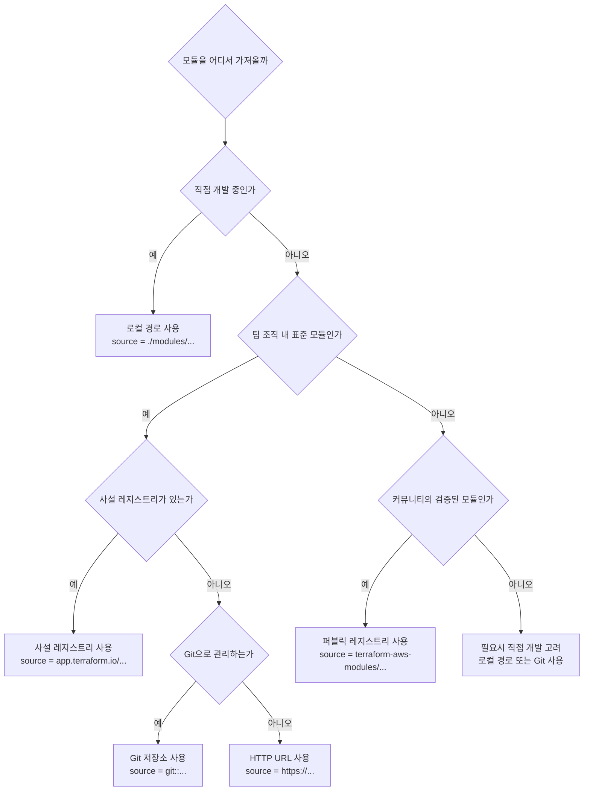

[이전 학습](../4-Use-Terraform-outside-the-core-workflow/4c-Describe-when-to-enable-verbose-logging-and-what-the-outcome-value-is.md) | [챕터 목록](./README.md) | [전체 목록](../README.md) | [다음 학습](./5b-Interact-with-module-inputs-and-outputs.md)

---

# 5a. 퍼블릭 Terraform 레지스트리를 포함한 다양한 모듈 소스 옵션 비교 및 사용

Terraform 모듈은 관련된 리소스 집합을 재사용 가능한 하나의 단위로 캡슐화하는 방법입니다. 모듈을 사용하면 코드의 중복을 줄이고, 인프라 구성을 체계적으로 관리할 수 있습니다.

`module` 블록의 `source` 인수는 Terraform이 모듈 코드를 어디에서 찾아야 하는지를 알려주는 경로이며, 다양한 옵션을 지원합니다.

## 모듈 소스(Module Source)의 종류

Terraform은 로컬 경로뿐만 아니라 다양한 원격 소스에서 모듈을 가져올 수 있습니다.

### 1. 로컬 경로 (Local Paths)

가장 간단한 모듈 소스입니다. 현재 작업 디렉토리를 기준으로 상대 경로에 있는 모듈을 참조합니다.

*   **언제 사용하나?**: 직접 개발한 모듈을 루트 구성에서 호출하거나, 모듈을 개발하고 테스트하는 과정에서 주로 사용됩니다.
*   **장점**: 간단하고 빠릅니다. 별도의 인증이나 네트워크 연결이 필요 없습니다.
*   **단점**: 버전 관리가 어렵고, 여러 프로젝트에서 공유하기 불편합니다.

**코드 예시**:

```terraform
module "web_server" {
  # 현재 디렉토리의 하위 'modules/aws-instance' 디렉토리에서 모듈을 찾음
  source = "./modules/aws-instance"
  
  instance_type = "t2.micro"
}
```

### 2. Terraform 레지스트리 (Terraform Registry)

Terraform의 공식 퍼블릭 레지스트리(`registry.terraform.io`)나 사설 레지스트리에 등록된 모듈을 참조합니다.

*   **언제 사용하나?**: 검증된 고품질의 모듈을 사용하고 싶을 때, 또는 조직 내에서 표준 모듈을 공유하고 배포할 때 사용합니다.
*   **주소 형식**: `<NAMESPACE>/<NAME>/<PROVIDER>`
*   **장점**: 버전 관리가 용이하고, 모듈을 쉽게 검색하고 재사용할 수 있습니다. 커뮤니티나 조직의 검증을 거친 모듈을 사용할 수 있어 신뢰성이 높습니다.
*   **단점**: 네트워크 연결이 필요하며, 사설 레지스트리는 별도의 구축 및 관리가 필요합니다.

**코드 예시**:

```terraform
module "vpc" {
  # Terraform 공식 레지스트리의 AWS VPC 모듈을 사용
  source  = "terraform-aws-modules/vpc/aws"
  version = "5.1.2"

  name = "my-vpc"
  cidr = "10.0.0.0/16"
  # ... other required inputs
}
```

### 3. Git 저장소 (Git Repositories)

GitHub, GitLab, Bitbucket 등 Git 기반의 원격 저장소에 있는 모듈을 직접 참조할 수 있습니다.

*   **언제 사용하나?**: Terraform 레지스트리를 사용하지 않으면서, 버전 관리 시스템을 통해 모듈을 중앙에서 관리하고 싶을 때 사용합니다.
*   **주소 형식**: `git::https://<HOSTNAME>/<PATH>.git?ref=<BRANCH_OR_TAG>`
*   **장점**: 별도의 레지스트리 없이 버전 관리(태그, 브랜치)가 가능합니다. Private 저장소도 지원합니다.
*   **단점**: `ref`를 통해 버전을 고정하지 않으면 예기치 않은 변경이 발생할 수 있습니다.

**코드 예시**:

```terraform
module "s3_bucket" {
  # GitHub 저장소의 특정 태그(v2.1.0)를 참조
  source = "git::https://github.com/example-org/terraform-aws-s3.git?ref=v2.1.0"

  bucket_name = "my-unique-app-bucket"
}
```

### 4. HTTP URL

HTTP URL을 통해 압축된 모듈 소스 코드(`.zip`, `.tar.gz` 등)를 다운로드하여 사용할 수 있습니다.

*   **언제 사용하나?**: 사내 아티팩트 저장소(예: Artifactory, Nexus) 등에 모듈을 저장하고 사용할 때 유용합니다.
*   **장점**: 기존의 아티팩트 관리 시스템과 통합하기 좋습니다.
*   **단점**: URL이 변경되거나 파일이 삭제될 위험이 있습니다. 버전 관리를 위한 별도의 체계가 필요합니다.

**코드 예시**:

```terraform
module "database" {
  source = "https://my-artifact-repo.example.com/modules/rds/v1.2.0.zip"
  
  # ...
}
```

## Mermaid 다이어그램: 모듈 소스 선택 플로우차트



---

## 예상 문제

1.  **다음 중 모듈의 `source` 인수로 사용할 수 없는 것은 무엇입니까?**<br>
    a. 로컬 파일 시스템 경로<br>
    b. Docker 이미지 주소<br>
    c. 퍼블릭 Terraform 레지스트리 주소<br>
    d. Git 저장소 URL<br>
    <br>
    <details>
    <summary>정답 확인</summary>
    <p>b</p>
    </details><br>

2.  **`source = "terraform-aws-modules/vpc/aws"` 와 같은 모듈 소스는 어디를 참조합니까?**<br>
    a. 로컬의 `terraform-aws-modules` 디렉토리<br>
    b. GitHub의 `terraform-aws-modules` 조직<br>
    c. 공식 Terraform 레지스트리<br>
    d. AWS에서 제공하는 내부 모듈<br>
    <br>
    <details>
    <summary>정답 확인</summary>
    <p>c</p>
    </details><br>

3.  **직접 모듈을 개발하고 테스트할 때 가장 일반적으로 사용되는 `source` 옵션은 무엇입니까?**<br>
    a. 로컬 경로<br>
    b. Terraform 레지스트리<br>
    c. Git 저장소<br>
    d. HTTP URL<br>
    <br>
    <details>
    <summary>정답 확인</summary>
    <p>a</p>
    </details><br>

4.  **Git 저장소를 모듈 소스로 사용할 때, 특정 버전(예: 태그 `v1.2.3`)을 사용하도록 지정하는 가장 좋은 방법은 무엇입니까?**<br>
    a. 주석으로 버전을 명시한다.<br>
    b. `version` 인수를 사용한다.<br>
    c. Git URL에 `?ref=v1.2.3` 파라미터를 추가한다.<br>
    d. Git 저장소를 로컬에 복제하여 로컬 경로로 참조한다.<br>
    <br>
    <details>
    <summary>정답 확인</summary>
    <p>c</p>
    </details><br>

5.  **사설 Terraform 레지스트리를 사용하는 주된 이점은 무엇입니까?**<br>
    a. 모듈 실행 속도가 가장 빠르다.<br>
    b. 조직 내에서 표준화되고 검증된 모듈을 안전하게 공유하고 재사용할 수 있다.<br>
    c. 모든 종류의 파일을 저장할 수 있다.<br>
    d. 별도의 버전 관리가 필요 없다.<br>
    <br>
    <details>
    <summary>정답 확인</summary>
    <p>b</p>
    </details><br>

6.  **`source = "./modules/network"` 와 같이 로컬 경로를 사용할 때의 단점은 무엇입니까?**<br>
    a. 다른 프로젝트에서 재사용하고 버전 관리하기가 어렵다.<br>
    b. `terraform init` 속도가 매우 느리다.<br>
    c. 입력 변수를 전달할 수 없다.<br>
    d. 모듈의 출력을 사용할 수 없다.<br>
    <br>
    <details>
    <summary>정답 확인</summary>
    <p>a</p>
    </details><br>

7.  **`terraform init` 명령은 모듈 소스와 관련하여 어떤 작업을 수행합니까?**<br>
    a. 모듈 코드를 실행하여 인프라를 생성한다.<br>
    b. `source` 인수에 지정된 위치에서 모듈 코드를 다운로드하여 `.terraform/modules` 디렉토리에 저장한다.<br>
    c. 모든 모듈을 Terraform 레지스트리에 자동으로 등록한다.<br>
    d. 모듈 코드의 문법 오류를 검사한다.<br>
    <br>
    <details>
    <summary>정답 확인</summary>
    <p>b</p>
    </details><br>

8.  **다음 중 GitHub private 저장소를 모듈 소스로 사용하기 위해 Terraform이 필요로 하는 것은 무엇입니까?**<br>
    a. GitHub 계정의 사용자 이름과 비밀번호<br>
    b. 해당 저장소에 접근할 수 있는 SSH 키 또는 HTTPS 자격 증명<br>
    c. GitHub 유료 플랜<br>
    d. Terraform Cloud 계정<br>
    <br>
    <details>
    <summary>정답 확인</summary>
    <p>b</p>
    </details><br>

9.  **퍼블릭 Terraform 레지스트리를 사용할 때, 모듈 주소의 형식으로 올바른 것은 무엇입니까?**<br>
    a. `<NAME>/<PROVIDER>/<NAMESPACE>`<br>
    b. `<PROVIDER>/<NAMESPACE>/<NAME>`<br>
    c. `<NAMESPACE>/<NAME>/<PROVIDER>`<br>
    d. `<NAME>/<NAMESPACE>/<PROVIDER>`<br>
    <br>
    <details>
    <summary>정답 확인</summary>
    <p>c</p>
    </details><br>

10. **모듈의 `source`를 Git 저장소의 특정 브랜치(예: `dev`)로 지정했을 때 발생할 수 있는 잠재적인 문제는 무엇입니까?**<br>
    a. `dev` 브랜치에 새로운 커밋이 푸시될 때마다, `terraform init` 실행 시 의도치 않은 최신 코드를 가져올 수 있다.<br>
    b. 브랜치 이름에는 슬래시(/)를 사용할 수 없다.<br>
    c. `main` 브랜치가 아니면 Terraform이 인식하지 못한다.<br>
    d. 모듈의 출력을 사용할 수 없게 된다.<br>
    <br>
    <details>
    <summary>정답 확인</summary>
    <p>a. 이 때문에 안정적인 운영 환경에서는 특정 태그(tag)나 커밋 해시(commit hash)를 사용하여 버전을 고정하는 것이 권장됩니다.</p>
    </details><br>

---

[이전 학습](../4-Use-Terraform-outside-the-core-workflow/4c-Describe-when-to-enable-verbose-logging-and-what-the-outcome-value-is.md) | [챕터 목록](./README.md) | [전체 목록](../../README.md) | [다음 학습](./5b-Interact-with-module-inputs-and-outputs.md)
