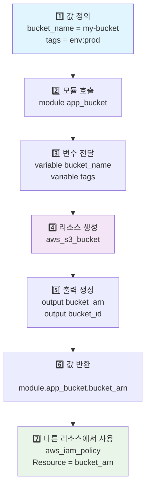

[이전 학습](./5a-Contrast-and-use-different-module-source-options-including-the-public-Terraform-Registry.md) | [챕터 목록](./README.md) | [전체 목록](../README.md) | [다음 학습](./5c-Describe-variable-scope-within-modules-child-modules.md)

---

# 5b. 모듈 입력(Inputs) 및 출력(Outputs)과 상호작용하기

Terraform 모듈은 재사용 가능한 코드 블록이지만, 그 자체로 완전한 것은 아닙니다. 모듈이 유연하고 강력해지려면 외부로부터 값을 전달받고, 자신이 생성한 리소스의 정보를 외부로 전달할 수 있어야 합니다. 이 통로 역할을 하는 것이 바로 <b>입력 변수(Input Variables)</b>와 <b>출력 값(Output Values)</b>입니다.

이 둘을 통해 모듈은 마치 잘 정의된 API처럼 동작하게 됩니다.

## 모듈 입력 변수 (Module Inputs)

모듈 입력 변수는 모듈을 호출하는 상위 구성(루트 또는 부모 모듈)에서 모듈 내부로 값을 전달하는 통로입니다. 모듈 내에서는 `variable` 블록으로 정의됩니다.

*   **정의 (모듈 내부 `variables.tf`)**: 모듈이 받을 값의 이름, 타입, 설명, 기본값 등을 정의합니다.
*   **사용 (모듈 호출부 `main.tf`)**: `module` 블록 내에서 인수(argument) 형태로 값을 전달합니다.

### 코드 예시

**1. 모듈 코드 (`modules/aws-s3-bucket/variables.tf`)**

모듈이 받을 입력 변수들을 정의합니다.

```terraform
variable "bucket_name" {
  description = "The desired name for the S3 bucket."
  type        = string
}

variable "acl" {
  description = "The access control list (ACL) for the bucket."
  type        = string
  default     = "private" # 기본값이 있으므로, 호출부에서 생략 가능
}

variable "tags" {
  description = "A map of tags to assign to the bucket."
  type        = map(string)
  default     = {}
}
```

**2. 모듈 호출 (`main.tf`)**

`module` 블록에서 정의된 변수들에 값을 할당합니다.

```terraform
module "app_bucket" {
  source = "./modules/aws-s3-bucket"

  # 입력 변수에 값 전달
  bucket_name = "my-unique-application-data-bucket"
  tags = {
    Environment = "Production"
    ManagedBy   = "Terraform"
  }
  # 'acl' 변수는 기본값이 있으므로 생략함 (기본값 "private"이 사용됨)
}
```

## 모듈 출력 값 (Module Outputs)

모듈 출력 값은 모듈이 생성한 리소스의 속성(attribute)을 모듈 외부의 상위 구성으로 내보내는 통로입니다. 모듈 내에서는 `output` 블록으로 정의됩니다.

이를 통해 다른 리소스가 모듈이 생성한 리소스의 정보(예: ID, IP 주소, ARN)를 참조할 수 있게 됩니다.

*   **정의 (모듈 내부 `outputs.tf`)**: 모듈이 외부로 내보낼 값의 이름과, 그 값이 어떤 리소스의 어떤 속성인지를 정의합니다.
*   **참조 (모듈 호출부 `main.tf`)**: `module.<모듈_이름>.<출력_이름>` 형식으로 값을 참조합니다.

### 코드 예시

**1. 모듈 코드 (`modules/aws-s3-bucket/outputs.tf`)**

모듈이 외부로 내보낼 값들을 정의합니다.

```terraform
output "bucket_id" {
  description = "The name of the S3 bucket."
  value       = aws_s3_bucket.this.id
}

output "bucket_arn" {
  description = "The ARN of the S3 bucket."
  value       = aws_s3_bucket.this.arn
}
```
*(위 코드에서 `aws_s3_bucket.this`는 모듈 내에 정의된 S3 버킷 리소스를 의미한다고 가정합니다.)*

**2. 출력 값 참조 (`main.tf`)**

`app_bucket` 모듈이 생성한 S3 버킷의 ARN을 다른 리소스(예: IAM 정책)에서 참조합니다.

```terraform
# 위에서 정의한 app_bucket 모듈...
module "app_bucket" {
  # ...
}

# 다른 리소스에서 모듈의 출력 값 참조
resource "aws_iam_policy" "bucket_access_policy" {
  name   = "s3-bucket-access-policy"
  policy = jsonencode({
    Version   = "2012-10-17",
    Statement = [
      {
        Effect   = "Allow",
        Action   = "s3:GetObject",
        Resource = "${module.app_bucket.bucket_arn}/*" # 출력값 참조
      }
    ]
  })
}
```

## Mermaid 다이어그램: 모듈의 Input/Output 흐름


이 다이어그램은 루트 모듈에서 정의한 값들이 `app_bucket` 모듈의 입력으로 들어가고, 모듈 내부의 리소스가 생성된 후 그 결과(ARN, ID)가 출력으로 나와 다른 리소스에서 어떻게 참조되는지를 명확하게 보여줍니다.

---

## 예상 문제

1.  **모듈을 호출하는 `module` 블록에서 모듈 내부로 값을 전달하기 위해 사용하는 것은 무엇입니까?**<br>
    a. 출력 값 (Output Values)<br>
    b. 지역 변수 (Local Values)<br>
    c. 입력 변수에 대한 인수 (Arguments for Input Variables)<br>
    d. `terraform.tfvars` 파일<br>
    <br>
    <details>
    <summary>정답 확인</summary>
    <p>c</p>
    </details><br>

2.  **모듈 내에서 생성된 리소스의 속성(예: IP 주소)을 모듈 외부에서 참조할 수 있도록 하려면 어떻게 해야 합니까?**<br>
    a. `output` 블록을 사용하여 해당 속성을 노출시킨다.<br>
    b. 상태 파일을 직접 읽어온다.<br>
    c. 전역 변수를 사용한다.<br>
    d. `data` 소스를 사용한다.<br>
    <br>
    <details>
    <summary>정답 확인</summary>
    <p>a</p>
    </details><br>

3.  **`web_server`라는 이름의 모듈이 `instance_id`라는 이름의 출력을 정의했습니다. 이 값을 참조하는 올바른 구문은 무엇입니까?**<br>
    a. `web_server.instance_id`<br>
    b. `module.web_server.instance_id`<br>
    c. `output.web_server.instance_id`<br>
    d. `module.instance_id`<br>
    <br>
    <details>
    <summary>정답 확인</summary>
    <p>b</p>
    </details><br>

4.  **모듈의 입력 변수에 `default` 값이 설정되어 있을 경우, 모듈 호출 블록에서 해당 인수를 생략하면 어떻게 됩니까?**<br>
    a. 오류가 발생한다.<br>
    b. Terraform이 사용자에게 값을 입력하라고 요청한다.<br>
    c. `default`에 지정된 값이 자동으로 사용된다.<br>
    d. 빈 문자열("")이 값으로 사용된다.<br>
    <br>
    <details>
    <summary>정답 확인</summary>
    <p>c</p>
    </details><br>

5.  **`variable` 블록의 `description` 속성의 주된 용도는 무엇입니까?**<br>
    a. 변수의 데이터 타입을 지정한다.<br>
    b. 변수에 대한 설명을 제공하여 코드 가독성을 높이고, `terraform-docs`와 같은 도구가 문서를 생성할 때 사용한다.<br>
    c. 변수가 민감한 정보인지 여부를 표시한다.<br>
    d. 변수의 유효성 검사 규칙을 정의한다.<br>
    <br>
    <details>
    <summary>정답 확인</summary>
    <p>b</p>
    </details><br>

6.  **모듈의 `output` 블록에 있는 `value` 인수는 무엇을 정의합니까?**<br>
    a. 출력 값의 데이터 타입<br>
    b. 출력 값에 대한 설명<br>
    c. 외부로 내보낼 실제 값 (주로 리소스의 속성을 참조)<br>
    d. 출력 값의 기본값<br>
    <br>
    <details>
    <summary>정답 확인</summary>
    <p>c</p>
    </details><br>

7.  **한 모듈의 출력 값을 다른 모듈의 입력 값으로 전달할 수 있습니까?**<br>
    a. 아니요, 모듈 간 직접적인 통신은 불가능합니다.<br>
    b. 예, `module.A.output_value`를 `module.B`의 입력 인수로 참조하여 전달할 수 있습니다.<br>
    c. `depends_on`을 통해서만 가능합니다.<br>
    d. 상태 파일을 수동으로 조작해야만 가능합니다.<br>
    <br>
    <details>
    <summary>정답 확인</summary>
    <p>b. 이는 모듈을 조합하여 더 큰 시스템을 구축하는 일반적인 패턴입니다.</p>
    </details><br>

8.  **모듈 내부에 정의된 리소스의 모든 속성은 자동으로 모듈 외부로 노출됩니까?**<br>
    a. 예, 모든 속성은 `module.<모듈_이름>.<리소스_이름>.<속성>`으로 참조할 수 있습니다.<br>
    b. 아니요, `output` 블록을 통해 명시적으로 노출하도록 정의한 속성만 외부에서 참조할 수 있습니다.<br>
    c. `public = true`로 설정된 속성만 노출됩니다.<br>
    d. 루트 모듈에서만 모든 속성이 노출됩니다.<br>
    <br>
    <details>
    <summary>정답 확인</summary>
    <p>b. 이는 모듈의 캡슐화를 보장하는 중요한 특징입니다.</p>
    </details><br>

9.  **모듈의 입력 변수 타입을 `number`로 지정했습니다. 만약 문자열 "123"을 전달하면 어떻게 될까요?**<br>
    a. Terraform이 자동으로 숫자로 변환하여 처리한다.<br>
    b. 유효성 검사 오류가 발생하며 `plan`이 실패한다.<br>
    c. 모듈 내부에서만 문자열로 처리된다.<br>
    d. `apply` 시점에 런타임 오류가 발생한다.<br>
    <br>
    <details>
    <summary>정답 확인</summary>
    <p>a. Terraform은 가능한 경우 타입 변환을 시도합니다. 하지만 변환할 수 없는 값(예: "abc")을 전달하면 오류가 발생합니다.</p>
    </details><br>

10. **`output` 블록에 `sensitive = true` 속성을 추가하면 어떤 효과가 있습니까?**<br>
    a. 해당 출력 값은 상태 파일에 저장되지 않는다.<br>
    b. `terraform plan`이나 `apply`의 결과 요약에서 해당 출력 값이 실제 값 대신 `(sensitive)`로 표시된다.<br>
    c. 해당 출력 값은 암호화되어 저장된다.<br>
    d. 해당 출력 값은 루트 모듈에서만 참조할 수 있다.<br>
    <br>
    <details>
    <summary>정답 확인</summary>
    <p>b. 이는 민감한 정보가 콘솔 로그에 노출되는 것을 방지하기 위한 기능입니다. 값 자체는 상태 파일에 여전히 일반 텍스트로 저장될 수 있습니다.</p>
    </details><br>

---

[이전 학습](./5a-Contrast-and-use-different-module-source-options-including-the-public-Terraform-Registry.md) | [챕터 목록](./README.md) | [전체 목록](../../README.md) | [다음 학습](./5c-Describe-variable-scope-within-modules-child-modules.md)
