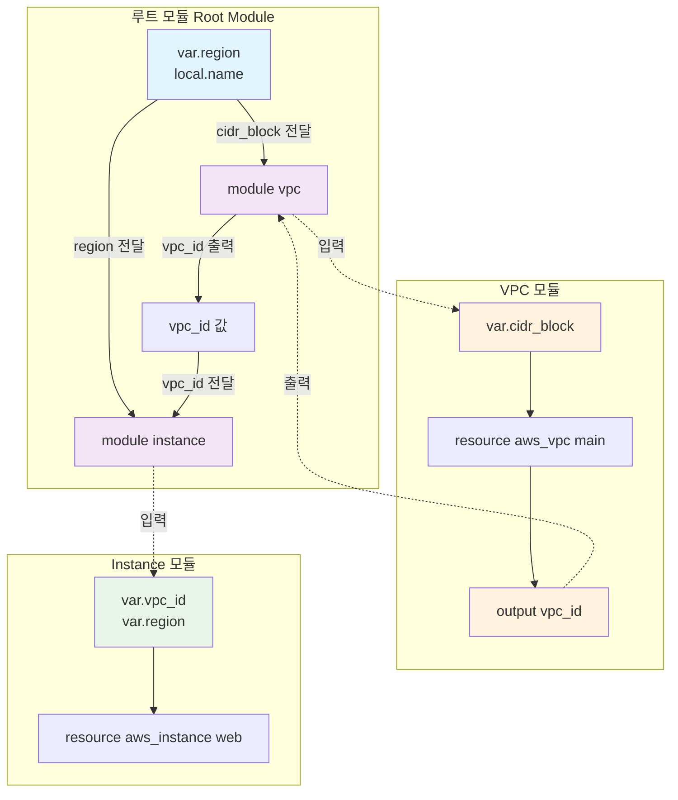

[이전 학습](./5b-Interact-with-module-inputs-and-outputs.md) | [챕터 목록](./README.md) | [전체 목록](../README.md) | [다음 학습](./5d-Set-module-version.md)

---

# 5c. 모듈/자식 모듈 내의 변수 범위(Scope) 설명

Terraform 모듈 시스템의 핵심적인 특징 중 하나는 <b>캡슐화(Encapsulation)</b>입니다. 각 모듈은 독립적인 변수 범위를 가지며, 이는 마치 프로그래밍 언어의 함수 스코프처럼 동작합니다. 이러한 구조는 변수 이름 충돌을 방지하고, 구성의 예측 가능성과 재사용성을 높여줍니다.

## 모듈의 변수 범위 규칙

1.  **모듈은 블랙박스(Black Box)다**: 모듈은 자신의 경계 내부만 볼 수 있습니다. 모듈 안에서는 모듈 내부에 정의된 리소스, 입력 변수, 지역 변수만 직접 참조할 수 있습니다.
2.  **부모-자식 관계**:
    *   **부모는 자식의 내부를 직접 볼 수 없다**: 부모 모듈(호출하는 쪽)은 자식 모듈(호출되는 쪽) 내부에 있는 리소스나 지역 변수를 직접 참조할 수 없습니다. 자식 모듈이 `output`으로 명시적으로 내보낸 값만 참조할 수 있습니다.
    *   **자식은 부모의 내부를 직접 볼 수 없다**: 자식 모듈은 자신을 호출한 부모 모듈의 변수나 리소스를 직접 참조할 수 없습니다. 부모가 `input` 변수를 통해 명시적으로 전달한 값만 사용할 수 있습니다.
3.  **형제 관계**: 형제 모듈(동일한 부모 모듈에 의해 호출된 다른 모듈들)은 서로의 내부를 전혀 볼 수 없습니다. 형제 모듈 간에 데이터를 전달하려면, 부모 모듈이 한 형제 모듈의 출력을 다른 형제 모듈의 입력으로 전달해주는 중개자 역할을 해야 합니다.

## Mermaid 다이어그램: 변수 범위 시각화



**다이어그램 설명**:

*   **루트 모듈**: `var.region`, `local.name`과 같은 자신의 변수를 가지고 있습니다.
*   **VPC 모듈 (자식 1)**: 루트 모듈로부터 `cidr_block` 같은 값을 **입력**받아 VPC를 생성하고, 생성된 `vpc_id`를 **출력**합니다. VPC 모듈은 루트 모듈의 `local.name`이나 Instance 모듈의 내부를 직접 알 수 없습니다.
*   **Instance 모듈 (자식 2)**: VPC 모듈의 **출력**(`module.vpc.vpc_id`)을 루트 모듈을 통해 자신의 **입력**(`var.vpc_id`)으로 전달받습니다. Instance 모듈은 VPC 모듈이나 루트 모듈의 다른 변수를 직접 알 수 없습니다.

이처럼 모든 데이터 전달은 모듈의 경계를 넘어 <b>입력(Inputs)</b>과 <b>출력(Outputs)</b>을 통해서만 명시적으로 이루어집니다.

## 코드 예시: 부모-자식 및 형제 모듈 간 데이터 흐름

**1. 루트 모듈 (`main.tf`)**

```terraform
# 루트 모듈의 지역 변수
locals {
  project_name = "MyApp"
}

# 자식 모듈 1: 네트워크 생성
module "network" {
  source = "./modules/vpc"

  # 루트 모듈의 지역 변수를 자식 모듈의 입력으로 전달
  vpc_name = local.project_name 
}

# 자식 모듈 2: 서버 생성
module "web_server" {
  source = "./modules/instance"

  instance_count = 2
  
  # 형제 모듈(network)의 출력을 다른 형제 모듈(web_server)의 입력으로 전달
  vpc_id         = module.network.vpc_id
  subnet_ids     = module.network.public_subnet_ids
}

# 루트 모듈의 출력
output "server_ips" {
  # 자식 모듈(web_server)의 출력을 루트 모듈의 출력으로 노출
  value = module.web_server.public_ips
}
```

**2. VPC 모듈 (`modules/vpc/main.tf` 및 `outputs.tf`)**

```terraform
# main.tf
variable "vpc_name" { type = string }
resource "aws_vpc" "this" {
  # ...
  tags = { Name = var.vpc_name }
}
# ... 서브넷 리소스들 ...

# outputs.tf
output "vpc_id" { value = aws_vpc.this.id }
output "public_subnet_ids" { value = aws_subnet.public[*].id }
```

**3. Instance 모듈 (`modules/instance/main.tf` 및 `outputs.tf`)**

```terraform
# main.tf
variable "vpc_id" { type = string }
variable "subnet_ids" { type = list(string) }
variable "instance_count" { type = number }

resource "aws_instance" "this" {
  count = var.instance_count
  # ...
  vpc_security_group_ids = [aws_security_group.this.id]
  subnet_id              = var.subnet_ids[count.index]
}
# ... 보안 그룹 리소스 ...

# outputs.tf
output "public_ips" { value = aws_instance.this[*].public_ip }
```

이 예시는 변수 범위 규칙이 어떻게 적용되는지를 명확히 보여줍니다. 모든 값의 전달은 `variable`과 `output`을 통해 모듈 경계를 넘나들며 명시적으로 이루어지고 있습니다.

---

## 예상 문제

1.  **Terraform 모듈 내에서, 그 모듈을 호출한 부모 모듈의 지역 변수(`locals`)를 직접 참조할 수 있습니까?**<br>
    a. 예, `var.parent.local_variable` 형식으로 참조할 수 있습니다.<br>
    b. 아니요, 부모 모듈의 변수를 참조하려면 부모가 자식 모듈의 입력 변수로 명시적으로 전달해야 합니다.<br>
    c. `parent` 키워드를 사용하면 참조할 수 있습니다.<br>
    d. `data` 소스를 사용해야만 참조할 수 있습니다.<br>
    <br>
    <details>
    <summary>정답 확인</summary>
    <p>b</p>
    </details><br>

2.  **루트 모듈에 `module "A"`와 `module "B"`가 정의되어 있습니다. `module "A"` 내부에서 `module "B"`가 생성한 리소스의 속성을 직접 참조하려면 어떻게 해야 합니까?**<br>
    a. `module.B.output_value` 형식으로 직접 참조할 수 있다.<br>
    b. 불가능하다. 형제 모듈 간의 직접적인 참조는 허용되지 않는다.<br>
    c. `sibling.B.output_value` 키워드를 사용한다.<br>
    d. `terraform.tfstate`를 직접 참조해야 한다.<br>
    <br>
    <details>
    <summary>정답 확인</summary>
    <p>b</p>
    </details><br>

3.  **두 형제 모듈 간에 데이터를 전달하는 올바른 방법은 무엇입니까?**<br>
    a. 한 모듈의 상태 파일을 다른 모듈에서 `data` 소스로 읽어온다.<br>
    b. 부모(루트) 모듈이 중개자 역할을 한다. 즉, 한 모듈의 출력을 다른 모듈의 입력으로 전달한다.<br>
    c. 전역 환경 변수를 사용한다.<br>
    d. 불가능하다.<br>
    <br>
    <details>
    <summary>정답 확인</summary>
    <p>b</p>
    </details><br>

4.  **모듈의 "캡슐화(Encapsulation)" 원칙이 의미하는 바로 가장 적절한 것은 무엇입니까?**<br>
    a. 모든 모듈은 Git 저장소에 있어야 한다.<br>
    b. 모듈의 내부 구현은 외부로부터 숨겨져 있으며, 오직 입력과 출력을 통해서만 상호작용한다.<br>
    c. 모듈은 항상 단 하나의 리소스만 포함해야 한다.<br>
    d. 모듈의 모든 변수는 민감한 정보로 처리되어야 한다.<br>
    <br>
    <details>
    <summary>정답 확인</summary>
    <p>b</p>
    </details><br>

5.  **루트 모듈에 정의된 `variable "region"`이 있습니다. 자식 모듈에서도 이 `region` 값을 사용하고 싶습니다. 자식 모듈에서 이 값을 어떻게 참조해야 합니까?**<br>
    a. 자식 모듈에서 `var.region`으로 직접 참조한다.<br>
    b. 자식 모듈에서 `root.var.region`으로 참조한다.<br>
    c. 자식 모듈에 `region` 입력 변수를 정의하고, 루트 모듈의 `module` 블록에서 `region = var.region`과 같이 전달받아야 한다.<br>
    d. 자식 모듈은 항상 부모의 변수를 상속받으므로 아무것도 할 필요가 없다.<br>
    <br>
    <details>
    <summary>정답 확인</summary>
    <p>c</p>
    </details><br>

6.  **자식 모듈의 `outputs.tf` 파일에 정의된 `output`의 범위(scope)는 어디까지입니까?**<br>
    a. 해당 자식 모듈 내부에서만 사용할 수 있다.<br>
    b. Terraform 실행 전체에서 전역적으로 사용할 수 있다.<br>
    c. 해당 자식 모듈을 호출한 직계 부모 모듈에서만 `module.<이름>.<출력>` 형식으로 참조할 수 있다.<br>
    d. 모든 형제 모듈에서 직접 참조할 수 있다.<br>
    <br>
    <details>
    <summary>정답 확인</summary>
    <p>c</p>
    </details><br>

7.  **모듈 내 `main.tf`에서 정의한 `resource "aws_instance" "web"`은 어디에서 참조할 수 있습니까?**<br>
    a. 오직 해당 모듈 내부에서만 `aws_instance.web`으로 참조할 수 있다.<br>
    b. 부모 모듈에서 `module.<모듈이름>.aws_instance.web`으로 참조할 수 있다.<br>
    c. 모든 자식 모듈에서 참조할 수 있다.<br>
    d. Terraform 구성 전체에서 참조할 수 있다.<br>
    <br>
    <details>
    <summary>정답 확인</summary>
    <p>a</p>
    </details><br>

8.  **다음 중 변수 범위 규칙이 제공하는 이점이 아닌 것은 무엇입니까?**<br>
    a. 서로 다른 모듈에서 동일한 변수 이름을 충돌 없이 사용할 수 있다.<br>
    b. 모듈의 재사용성이 높아진다.<br>
    c. `terraform apply` 실행 속도가 빨라진다.<br>
    d. 구성의 어느 부분에서 데이터가 오가는지 명확히 추적할 수 있다.<br>
    <br>
    <details>
    <summary>정답 확인</summary>
    <p>c</p>
    </details><br>

9.  **중첩된 모듈 구조(루트 -> 자식 -> 손자)에서, 루트 모듈의 변수를 손자 모듈에 전달하려면 어떻게 해야 합니까?**<br>
    a. 손자 모듈에서 `root.var.variable_name`으로 직접 참조한다.<br>
    b. 루트 모듈의 변수를 자식 모듈의 입력으로 전달하고, 다시 자식 모듈에서 그 값을 손자 모듈의 입력으로 전달해야 한다. (입력/출력 체인)<br>
    c. 불가능하다. 모듈은 한 단계 깊이까지만 중첩될 수 있다.<br>
    d. `global` 변수로 선언해야 한다.<br>
    <br>
    <details>
    <summary>정답 확인</summary>
    <p>b</p>
    </details><br>

10. **모듈의 입력 변수(variable)와 지역 변수(locals)의 범위 차이는 무엇입니까?**<br>
    a. 차이가 없다. 둘 다 모듈 내부에서만 사용 가능하다.<br>
    b. 입력 변수는 외부에서 값을 받아 초기화되고, 지역 변수는 모듈 내부에서만 정의되고 사용된다.<br>
    c. 지역 변수는 부모 모듈에서 참조할 수 있지만, 입력 변수는 불가능하다.<br>
    d. 입력 변수는 모든 자식 모듈에 상속되지만, 지역 변수는 그렇지 않다.<br>
    <br>
    <details>
    <summary>정답 확인</summary>
    <p>b. 입력 변수는 모듈의 "API" 역할을, 지역 변수는 모듈 내부의 "임시 변수" 역할을 합니다.</p>
    </details><br>

---

[이전 학습](./5b-Interact-with-module-inputs-and-outputs.md) | [챕터 목록](./README.md) | [전체 목록](../../README.md) | [다음 학습](./5d-Set-module-version.md)
